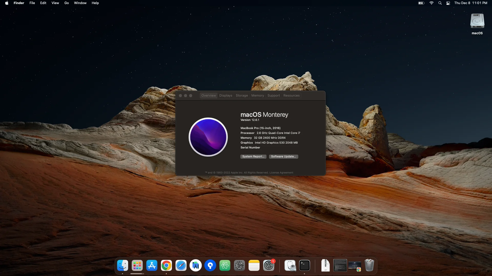

## Current System:

**macOS version**: 12.6.1 (Monterey)\
**OpenCore version**: 0.8.8

| **Component**    | **Model**                                  |
| ---------------- | ------------------------------------------ |
| CPU              | Intel Core i7 Quad-Core 2.6 GHz            |
| RAM              | 32GB (2 x 16GB) 240 0MHz DDR4              |
| GPU              | Intel HD Graphics 530 2GB                  |
| System           | MacBookPro13,3 (15-inch, 2016)             |
| OpenCore         | 0.8.8                                      |
| macOS            | 12.6.1                                     |


## Credits:
The Monterey variant is based on the great work of @golimpo.

## What's not working:

- SD-Card reader
- Killer 1535 Wifi (rarely used in the 9550, though if you have it, it must be replaced)
- nVidia Graphics card
- Thunderbolt 3

## Requirements:

- One working MAC OS X Environment
- 16GB USB Stick (a larger drive may not bootable and/or require advanced partitioning)
- MacOS Monterey 12.0 installation file from the app store (re-download, just in case)
- Knowledge of editing PLIST files
- USB drive for backup - you'll lose all data on your computer!

## Locations and required Files

- [This repository](https://github.com/dodsont/EFI-OPENCORE-Dell-XPS-9550/archive/refs/tags/0.8.8-Monterey.zip). Unzip this to a folder of your choice, I'll refer to this folder as "./" throughout the rest of the tutorial.
- EFI Partition containing the folder "EFI". This is a hidden partition on your HD/SSD. After mounting it's normally available at /Volumes/EFI/EFI/. I'll refer to it as "EFI/" throughout the rest of the tutorial.

## Step 0: Prepare Installation

### Firmware Update

If your Firmware is below 1.2.25, upgrade your EFI to at least 1.8 using the Firmware Update (See this repository Additional/BIOS). Click [here for a Step by Step Tutorial](Additional/bios_upgrade.md)

### SSD Sector Size (optional)

Optional: check if your SSD can be switched to 4k sector size. See [this Tutorial](4k_sector.md)

### Remove all Hacks from your Installation (Only on Update / Recovery from TimeMachine)

If you upgrade from an old version of OSX and you want to skip Step 2 from this tutorial - make sure to remove ALL old kexts / hacks / tools before you continue. Remnants will most likely break your installation. If you use Time Machine: create the backup after removing everything, otherwise Time Machine can/will restore the old hacks.

### Create Boot Media

Use the existing Mac to download the 12.0 installer from the App Store (make sure you have the full version) and create a bootable USB stick with OpenCore. Open Terminal and enter `diskutil list` and search for the deviceid of the USB stick (ex. disk2). Then reformat it by entering

```
diskutil partitionDisk /dev/disk2 GPT JHFS+ Monterey 0b
```

copy the Catalina installation files to the stick by entering

```
sudo /Applications/Install\ macOS\ Monterey.app/Contents/Resources/createinstallmedia --volume /Volumes/Monterey --nointeraction
```

then install opencore onto the USB stick (use google in case you dont know how, it is pretty straight forward).
Check twice that you definitely selected the USB stick as the target, installing opencore on the internal HDD/SSD can break your working system!

Mount the hidden EFI partition of the USB Stick by entering
`diskutil mount EFI`
inside the terminal. Mac OS will automatically mount the EFI partition of the USB stick and not the local machine, but it is worth double checking you havent accidentallly mounted the EFI partition of the host machine to prevent accidental damage to it.

Overwrite everything in the OC folder of the partition EFI with the content of ./12.0/OC.  

You have to enter a valid serial number, MLB and other variables (so called SMBIOS) to the config.plist in EFI/OC/.  

If your PC has a Core i5 processor, you'll have to modify your config.plist in EFI/OC/: search for the Key AAPL,ig-platform-id: AAAbGQ== and replace it with AAAWGQ==
If your PC is equipped with a HYNIX/Plextor/LiteOn SSD - you have to change the config.plist and enable the IONVMeFamily "Ignore FLBAS bit:4 being set" patch.

## Step 1: Configure your Notebook

Go into the EFI Configuration (BIOS) of your Dell XPS 15:

```
gymnae said:
In order to boot the Clover (now opencore) from the USB, you should visit your BIOS settings:
- "VT-d" (virtualization for directed i/o) should be disabled if possible (the config.plist includes dart=0 in case you can't do this)
- "DEP" (data execution prevention) should be enabled for OS X
- "secure boot " should be disabled
- "legacy boot" optional
- "CSM" (compatibility support module) enabled or disabled (varies)
- "boot from USB" or "boot from external" enabled`

Note: If you get a "garbled" screen when booting the installer in UEFI mode, enable legacy boot and/or CSM in BIOS (but still boot UEFI). Enabling legacy boot/CSM generally tends to clear that problem.
In my case I left VT-d and Fastboot as they were. Also, update your 9550 to the latest BIOS.
Don't forget to set mode to "AHCI" in the sub-menu "SATA Operation" of "System Configuration". It's mandatory.
```

Also disable the SD-Card Reader to reduce the power consumption drastically. Insert the stick on the Dell XPS 15 and boot it up holding the F12 key to get to the boot-menu and start by selecting your USB stick (if you've done this correctly you will see the name "Install macOS Monterey", otherwise you will just see the brand name of your USB stick). You should now get to the MacOS Installation, just as it would appear on a real mac. If you're asked to log-in with your apple-id: select not now! Reason: see Step 5.

## Step 2: Partition

WARNING: after this step your computer will loose ALL data! So if you haven't created a backup, yet: QUIT NOW!

Don't install macOS yet. Select the Diskutil and delete the old partitions. Create a new HFS partition and name it "OSX". If you want to multiboot with Windows 10, then you'll have to create a second partition too. Make sure to select HFS, dont use FAT or it will not boot! (You can reformat the second parittion when installing Windows). Make sure to select GUID as partition scheme.
Close the Diskutil.

## Step 3: Install and make it bootable

Install OSX as you would on a real mac. You'll have to reboot multiple times - make sure to always boot using the attached USB stick => don't forget to press F12 if you didn't set the USB stick as your primary boot device. After the first reboot you should see a new boot option called "Install macOS Monterey from OSX", which is highlighted by default. Just press enter. If you only see one boot device, then something went wrong and you should retry the installation. After a few reboots you should be inside your new macOS enviroment. You can always boot into it using the USB stick. Remove the USB drive after successful bootup. To make it bootable, enter
`diskutil mount EFI`
in your terminal, which should mount the EFI partition of your local installation.
Now copy everything from ./12.0/OC to EFI/OC like you did before when creating the USB stick. Note: If you had to modify the config.plist in step 1, do it here too. Your system should now be bootable by itself. Reboot to verify.

## Step 4: Post Installation

Because all DSDT/SSDT changes are already in the config.plist, you dont need to recompile your DSDT (though I suggest doing it anyway to make your system more reliable, see gymnaes El-Capitan tutorial for more information). For now we can skip this part. Open a terminal and go to the GIT folder. This step is optional as it only contains NullEthernet.kext. If you are using the stock Broadcom wireless card you can use the Wi-Fi as en0.

```
sudo cp -r ./12.0/Post-Install/LE-Kexts/* /Library/Extensions/
```

Run 12.0/Post-Install/Additional Steps/Audio/install.sh to install ComboJack

Finalize the kext-copy by recreating the kernel cache:

```
sudo rm -rf /System/Library/Caches/com.apple.kext.caches/Startup/kernelcache
sudo rm -rf /System/Library/PrelinkedKernels/prelinkedkernel
sudo touch /System/Library/Extensions && sudo kextcache -u /
```

Sometimes you'll have to redo the last command if your system shows "Lock acquired".

OSX 10.12.2 removed the possibility to load unsigned code. You can enable this by entering
`sudo spctl --master-disable`

If you have the FHD (1080p) version of the Notebook, set the `UIScale` to `AQ==` (1) in the OC _config.plist_ file.

To prevent accidental hibernation (which can and will corrupt your data if you're not using the 4k switch), enter the following
`sudo pmset -a hibernatemode 0` or run the script in `./12.0/Post-Install/Additional\ Steps/Hibernation/disablehibernate.sh`

Take a look in the folder `/12.0/Post-Install/Additional\ Steps/`. There are multiple fixes for various bugs or problems. Use the supplied tools only when needed. These folders always contain a separate readme file to explain their functionality, requirements and general usage.

## Step 5: iServices (AppStore, iMessages etc.)

If you want to use the iServices, you'll have to do some advanced steps, which are not completely explained in this tutorial. If you are using NullEthernet.kext from step 4 or your Wi-Fi card is not en0. Go to your network settings and remove every network interface, then `sudo rm /Library/Preferences/SystemConfiguration/NetworkInterfaces.plist` and reboot. Go back in the network configuration and add the network interfaces (LAN) before Wi-Fi if you are using NullEthernet.kext or add Wi-Fi. If you are using Wi-Fi with no NullEthernet.kext make sure it is en0 before continuing.
You also need to modify your SMBIOS in the config.plist of OpenCore in your EFI partition with valid information about your "fake" mac. There are [multiple tutorials](http://www.fitzweekly.com/2016/02/hackintosh-imessage-tutorial.html) which explain how to do it.
It's possible you may need to call the apple hotline to get your fake serial whitelisted by telling a good story why apple forgot to add your serial number in their system. (aka: don't do it if you don't own a real mac). I personally suggest using real data from an old (broken) MacBook.

## Step 6: Upgrading to macOS 12.0.1 or higher / installing security updates

Each upgrade will possibly break your system!
After each upgrade if you have kexts in your /Library/Extensions folder you will have to recreate the kernel cache by running these:

```
sudo rm -rf /System/Library/Caches/com.apple.kext.caches/Startup/kernelcache
sudo rm -rf /System/Library/PrelinkedKernels/prelinkedkernel
sudo touch /System/Library/Extensions && sudo kextcache -u /
```

Sometimes you'll have to redo the last command if your system shows "Lock acquired".

## Step 7: Fixes / Enhancements / Alternative Solutions / Bugs

## HDMI/VGA Video-Out Fix for MBP13,3
Open /System/Library/Extensions/AppleGraphicsControl.kext/Contents/PlugIns/AppleGraphicsDevicePolicy.kext/Contents/Info.plist  
Find the Board-ID which used in your config.plist.  
Replace the attribute Config2 with none  
`sudo kextcache -system-prelinked-kernel && sudo kextcache -system-caches`  
reboot

## Error: couldn't allocate runtime area / unable to start installer / unable to boot at all
Since OSXAptio is a lil bit picky with memory maps, you have to swap to OSXAptioV2 and choose a different slide= command (see question above) to a suitable number. Change the slide param in the config.plist. See [this Tutorial](/Additional/slide_calc.md) for more informations. It is still possible you cant get it to boot because no memory section is big enough. There are multiple different options available, but each of them has to be considered experimental or buggy.

## Display Backlight Control not working
the supplied AppleBacklightInjector contains an id for the display. It is possible that this id is different on your machine (especially if you use the non touch display). In this case just follow [this tutorial](Additional/PatchAppleBacklight_v2/readme.md)

## Display Flickers randomly
See tutorial in [Additional/EDID-Injector](Additional/Tools/EDID-Injector) for possible fix.  

## Display ICC Calibration
ICC profile for 4k screen calibrated with Spyder4Pro colorimeter and DisplayCAL is available in Additional/Profiles.   
Every panel is a lil bit different, so don't expect too much precision, but this profile works great for sRGB and AdobeRGB.

## Sleep results in reboot
This is only in case sleep worked in the past. If you have sleep issues from the beginning and you strictly followed this tutorial (check at least twice!), you need additional assistance (easiest way is asking in a forum).  

Sometimes (especially on a dual boot environment after booting in the other OS) a normal sleep results in a full (and dirty) reboot. For me the old behavior can be obtained by issuing this command: `sudo pmset -a hibernatemode 0 && sudo reboot`, albeit already being in hibernate mode 0. The reboot is mandatory, otherwise it doesn't work. Some people reported this fixes their problems, while other still had sleep issues. Just give it a shot.

## Additional Resources / Request help
This thread include many solutions to the less common problems.
http://www.insanelymac.com/forum/topic/319764-guide-dell-xps-15-9550-sierra-10122-quick-installation/  
also please check if your question is already answered here: https://github.com/dodsont/EFI-OPENCORE-Dell-XPS-9550/issues?q=is%3Aissue+is%3Aclosed

## Appendix 1: Accessories

The official [Dell adaptor DA200](http://accessories.euro.dell.com/sna/productdetail.aspx?c=at&l=de&s=dhs&cs=atdhs1&sku=470-abry) seem to work. You can use the Network, USB, HDMI and VGA.
A cheap 3rd party unbranded USB-C -> VGA adaptor won't work. You can charge the Dell with a generic USB-C Power Adaptor, but USB-C has a maximum power of only 100W, so it's either charging OR usage, not both. Don't forget you need a special USB-C cable (Power Delivery 3.0) for charging. Charging with the Apple USB-C Charger works, but will be limited to ~60W (and therefore throttle the whole system).

The WD15 Docking works as well, but cannot be hot-plugged and may break the sleep of your device. Ethernet requires [the official realtek drivers](https://www.realtek.com/en/component/zoo/category/network-interface-controllers-10-100-1000m-gigabit-ethernet-usb-3-0-software) to work.
